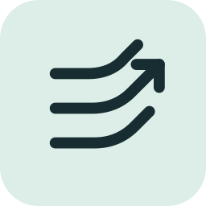

<p align="center">
  
</p>

<h1 align="center">AeroSpace Gestures</h1>

<p align="center"><strong>Small gesture. Your command.</strong></p>

macOS trackpad gestures do not directly run your [AeroSpace WM](https://github.com/nikitabobko/AeroSpace) commands. AeroSpace Gestures maps three-to-five-finger swipes and opt-in two-to-five-finger pinch-in/spread-out gestures to commands.

Use the menu-bar icon to pause commands or reload your configuration.

## Install

Requires macOS 13+ and a multitouch trackpad. Choose one method:

- Homebrew: `brew install cristianoliveira/tap/aerospace-gestures`
- Nix, from a checkout with flakes enabled: `nix profile install .`
- Build from a checkout with Swift 5.9+: `make install` (installs to `~/.local/bin`; add it to your `PATH`).

`make install` will not replace an existing binary; see the [update steps](docs/USAGE.md#service-troubleshooting-and-updates) if you use the built-in service. If several versions are installed, use `type -a aerospace-gestures` to see which one runs.

## Try it

```sh
aerospace-gestures init ./config.toml   # once; does not overwrite an existing config
aerospace-gestures check ./config.toml
aerospace-gestures run ./config.toml
```

Swipe **three fingers down** to show the example popup. Press Ctrl-C to stop. To observe gestures without running commands, use `aerospace-gestures listen start`.

## Example config

Save this as `config.toml` to open Calculator with a three-finger left swipe:

```toml
[[bindings]]
fingers = 3
direction = "left"
command = ["/usr/bin/open", "-a", "Calculator"]
```

## Troubleshooting

If no gestures appear, grant your terminal **Input Monitoring** permission and restart the listener. See the [Usage guide](docs/USAGE.md) for service management and other checks.

## Guides

[Configuration](docs/CONFIGURATION.md) · [Usage](docs/USAGE.md) · [Development](docs/DEVELOPMENT.md) · [Architecture](docs/ARCHITECTURE.md)
