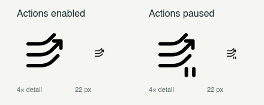

# AeroSpace Gestures brand

**Triple Swipe** is the project mark: three touch trails become a directional command. The trails represent multitouch, not a three-finger-only restriction. The app supports three-to-five-finger swipes and opt-in two-to-five-finger pinches.

**Tagline:** Small gesture. Your command.

## Assets

- [logo.svg](logo.svg): deep-teal mark on a rounded mint tile, used in the main README. Its fixed colors work on light and dark page backgrounds.
- [triple-swipe.svg](triple-swipe.svg): transparent monochrome mark with `currentColor` strokes; black by default. Inline it to inherit a CSS color.
- [menu-bar-preview.png](menu-bar-preview.png): enabled and paused images rendered by the AppKit drawing code, with enlarged and 22 px samples. This is an offscreen rendering, not a live menu-bar screenshot.

## Treatment

- Deep teal: `#172D32`. Mint: `#DCEEE7`.
- Keep the mark's proportions and rounded stroke ends.
- Use the monochrome mark, not the mint tile, in the menu bar.
- Keep the brand mark visible when paused; add the two-bar badge. Do not rely on color to communicate state.
- The icon describes action dispatch, not trackpad health. Keep the explicit menu and accessibility labels.

## Native implementation

[`MenuBarIcon.swift`](../../Sources/GestureCLI/MenuBarIcon.swift) draws the same 256-point paths into a 22 × 22 pt `NSImage`. The image is a template, so macOS controls its light/dark rendering. Both states keep the same canvas size. Drawing in code preserves binary-only installation without a resource bundle or runtime asset lookup.

The SVG mark and native paths are intentionally small, separate representations. When changing the geometry, update both SVG assets and the native drawing, then rerun `swift test --filter MenuBarIconTests` and visually compare both states at native size. Live menu-bar appearance still needs manual verification after installing and restarting the updated binary.

The [original options](../icon-options/README.md) remain available as design history.
